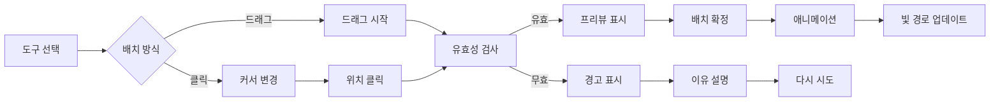

# Mirror Maze UX 개선 설계 문서

## 📋 목차
1. [개요](#개요)
2. [현재 UX 문제점 분석](#현재-ux-문제점-분석)
3. [개선된 UX 설계](#개선된-ux-설계)
4. [상세 인터랙션 설계](#상세-인터랙션-설계)
5. [비주얼 디자인 가이드라인](#비주얼-디자인-가이드라인)
6. [접근성 및 반응형 설계](#접근성-및-반응형-설계)
7. [구현 우선순위](#구현-우선순위)
8. [성공 지표](#성공-지표)

---

## 개요

### 프로젝트 목표
Mirror Maze 게임의 사용자 경험을 획기적으로 개선하여 모든 연령대의 사용자가 직관적으로 게임을 즐길 수 있도록 한다.

### 핵심 개선 방향
- **직관성**: 설명 없이도 이해 가능한 인터페이스
- **접근성**: 모든 사용자가 쉽게 접근 가능
- **피드백**: 모든 액션에 즉각적인 시각/청각 피드백
- **유연성**: 다양한 플레이 스타일 지원

---

## 현재 UX 문제점 분석

### 🔴 치명적 문제
1. **온보딩 부재**
   - 신규 사용자가 게임 방법을 즉시 이해하기 어려움
   - 도구 사용법에 대한 설명 없음

2. **복잡한 도구 전환**
   - 배치/회전/제거 모드 전환이 혼란스러움
   - 현재 선택된 도구/모드가 명확하지 않음

3. **실수 복구 불가**
   - Undo/Redo 기능 없음
   - 잘못된 배치 시 전체 리셋만 가능

### 🟡 주요 문제
1. **불충분한 피드백**
   - 도구 배치 가능 위치 표시 없음
   - 빛 경로 예측 불가

2. **진행 상황 불투명**
   - 전체 게임 진행도 확인 불가
   - 레벨별 최고 기록 표시 없음

3. **모바일 사용성**
   - 터치 인터페이스 미지원
   - 작은 화면에서 조작 어려움

---

## 개선된 UX 설계

### 1. 🎯 직관적인 온보딩 시스템

#### 1.1 인터랙티브 튜토리얼
```
[첫 실행 시]
1. 웰컴 화면 → "처음이신가요?" 
2. 단계별 가이드 (Skip 가능)
   - Step 1: 빛의 기본 원리 (애니메이션)
   - Step 2: 거울 배치 연습 (실습)
   - Step 3: 목표 달성 연습 (실습)
3. 첫 레벨 도전 (도우미 활성화)
```

#### 1.2 컨텍스트 힌트
- 처음 사용하는 도구에 툴팁 자동 표시
- 막힌 상태 감지 시 힌트 제안
- 진행률 기반 적응형 도움말

### 2. 🎮 심플한 도구 시스템

#### 2.1 드래그 앤 드롭 인터페이스
```
[개선된 플로우]
1. 도구 선택 → 드래그 시작
2. 유효 위치 하이라이트 (초록색)
3. 무효 위치 표시 (빨간색)
4. 드롭 → 즉시 배치 + 애니메이션
```

#### 2.2 원클릭 모드
- 도구 클릭 → 보드 클릭으로 배치
- 우클릭으로 회전
- 중클릭으로 제거

#### 2.3 빠른 도구 전환
- 숫자 키 (1-7) 도구 즉시 선택
- Tab 키로 도구 순환
- Space 바로 마지막 도구 재선택

### 3. 📊 강화된 피드백 시스템

#### 3.1 시각적 피드백
```
배치 전:
- 호버 시 반투명 프리뷰
- 예상 빛 경로 점선 표시
- 충돌 영역 빨간색 표시

배치 후:
- 부드러운 등장 애니메이션
- 빛 경로 실시간 업데이트
- 성공 시 파티클 효과
```

#### 3.2 청각 피드백
- 도구별 고유 배치음
- 빛 반사음 (거울 타입별 다름)
- 목표 달성 시 멜로디
- 실패 시 부드러운 경고음

#### 3.3 햅틱 피드백 (모바일)
- 배치 성공: 짧은 진동
- 목표 달성: 패턴 진동
- 잘못된 시도: 약한 진동

### 4. ↩️ 스마트 실행 취소 시스템

#### 4.1 무제한 Undo/Redo
```
인터페이스:
┌─────────────────────────┐
│ [↶ Undo] [↷ Redo]      │
│ 히스토리: 12 액션        │
└─────────────────────────┘
```

#### 4.2 히스토리 타임라인
- 시각적 히스토리 바
- 특정 시점으로 즉시 이동
- 중요 체크포인트 자동 저장

#### 4.3 스마트 되돌리기
- 연관된 액션 그룹 단위 취소
- "마지막 도구 제거" 옵션
- "레벨 시작 상태로" 옵션

### 5. 🎯 적응형 힌트 시스템

#### 5.1 단계별 힌트
```
레벨 1 (자동):
- "거울을 여기 놓아보세요" (위치 표시)

레벨 2 (요청 시):
- "빛이 목표에 도달하려면 2개의 거울이 필요합니다"

레벨 3+ (프리미엄):
- 다음 최적 수 표시
- 해결 경로 일부 공개
```

#### 5.2 행동 기반 힌트
- 30초 이상 액션 없음 → "힌트가 필요하신가요?"
- 같은 실수 3회 → 구체적 조언 제공
- 거의 완성 → "한 걸음만 더!"

### 6. 📈 진행 상황 대시보드

#### 6.1 전체 진행도
```
┌──────────────────────────────┐
│  전체 진행도: 45%            │
│  ████████░░░░░░░░            │
│                              │
│  완료: 8/20 레벨             │
│  총 별: 18/60 ⭐             │
│  플레이 시간: 2시간 15분      │
└──────────────────────────────┘
```

#### 6.2 레벨별 통계
- 최고 기록 (이동 수)
- 평균 클리어 시간
- 전체 사용자 대비 순위
- 친구 순위 (소셜 기능)

#### 6.3 도전 과제
- 일일 도전
- 주간 목표
- 특별 업적
- 보상 시스템

### 7. 🎨 개인화 옵션

#### 7.1 테마 선택
- 라이트/다크 모드
- 색맹 모드 (3종)
- 고대비 모드
- 커스텀 색상 팔레트

#### 7.2 난이도 조절
- 힌트 빈도
- 자동 도움 레벨
- 시간 제한 on/off
- 이동 수 제한 on/off

#### 7.3 컨트롤 커스터마이징
- 키 바인딩 변경
- 마우스 감도
- 터치 제스처 설정
- 게임패드 지원

---

## 상세 인터랙션 설계

### 도구 배치 플로우



### 모바일 제스처

| 제스처 | 액션 |
|--------|------|
| 탭 | 도구 선택/배치 |
| 롱프레스 | 도구 정보 보기 |
| 드래그 | 도구 이동 |
| 핀치 | 줌 인/아웃 |
| 두 손가락 탭 | 실행 취소 |
| 두 손가락 스와이프 | 레벨 이동 |
| 회전 제스처 | 거울 회전 |

### 키보드 단축키 (개선)

| 키 | 기능 | 설명 |
|----|------|------|
| 1-7 | 도구 선택 | 숫자로 빠른 선택 |
| Q/E | 도구 순환 | 이전/다음 도구 |
| R | 회전 | 선택된 도구 회전 |
| F | 뒤집기 | 거울 방향 전환 |
| Space | 배치/선택 | 현재 위치에 배치 |
| Delete | 제거 | 커서 위치 도구 제거 |
| Ctrl+Z | 실행 취소 | 마지막 액션 취소 |
| Ctrl+Y | 다시 실행 | 취소한 액션 복구 |
| H | 힌트 | 힌트 표시/숨기기 |
| M | 음소거 | 사운드 on/off |
| ESC | 취소/메뉴 | 현재 액션 취소 |
| Tab | 모드 전환 | 배치↔선택 모드 |
| Shift+클릭 | 다중 선택 | 여러 도구 선택 |
| Alt+드래그 | 복사 | 도구 복제 배치 |

---

## 비주얼 디자인 가이드라인

### 색상 시스템

#### 주요 색상
```css
:root {
  /* Primary */
  --primary-light: #7C3AED;  /* 밝은 보라 */
  --primary-main: #6D28D9;   /* 메인 보라 */
  --primary-dark: #5B21B6;   /* 어두운 보라 */
  
  /* 빛 색상 */
  --light-white: #FFFFFF;
  --light-red: #EF4444;
  --light-green: #10B981;
  --light-blue: #3B82F6;
  --light-yellow: #F59E0B;
  
  /* 상태 색상 */
  --success: #10B981;
  --warning: #F59E0B;
  --error: #EF4444;
  --info: #3B82F6;
  
  /* 중성 색상 */
  --gray-50: #F9FAFB;
  --gray-900: #111827;
}
```

#### 다크 모드
```css
[data-theme="dark"] {
  --bg-primary: #111827;
  --bg-secondary: #1F2937;
  --text-primary: #F9FAFB;
  --text-secondary: #D1D5DB;
}
```

### 타이포그래피

```css
/* 제목 */
.heading-1 {
  font-size: 2.5rem;
  font-weight: 700;
  line-height: 1.2;
}

/* 본문 */
.body-text {
  font-size: 1rem;
  font-weight: 400;
  line-height: 1.5;
}

/* 버튼 텍스트 */
.button-text {
  font-size: 0.875rem;
  font-weight: 600;
  text-transform: uppercase;
  letter-spacing: 0.05em;
}
```

### 애니메이션 가이드

#### 마이크로 인터랙션
```css
/* 호버 효과 */
.interactive-element {
  transition: all 0.2s ease-out;
}

.interactive-element:hover {
  transform: translateY(-2px);
  box-shadow: 0 4px 12px rgba(0,0,0,0.15);
}

/* 배치 애니메이션 */
@keyframes placeAnimation {
  0% {
    transform: scale(0) rotate(0deg);
    opacity: 0;
  }
  50% {
    transform: scale(1.1) rotate(5deg);
  }
  100% {
    transform: scale(1) rotate(0deg);
    opacity: 1;
  }
}

/* 빛 흐름 애니메이션 */
@keyframes lightFlow {
  0% {
    stroke-dashoffset: 100;
  }
  100% {
    stroke-dashoffset: 0;
  }
}
```

### 컴포넌트 스타일

#### 버튼
```css
.button {
  /* 기본 스타일 */
  padding: 12px 24px;
  border-radius: 8px;
  font-weight: 600;
  transition: all 0.2s;
  
  /* 그림자 */
  box-shadow: 0 2px 4px rgba(0,0,0,0.1);
}

.button:hover {
  transform: translateY(-1px);
  box-shadow: 0 4px 8px rgba(0,0,0,0.15);
}

.button:active {
  transform: translateY(0);
  box-shadow: 0 1px 2px rgba(0,0,0,0.1);
}
```

#### 카드
```css
.card {
  background: white;
  border-radius: 12px;
  padding: 20px;
  box-shadow: 0 1px 3px rgba(0,0,0,0.1);
  transition: all 0.3s;
}

.card:hover {
  box-shadow: 0 10px 30px rgba(0,0,0,0.15);
}
```

---

## 접근성 및 반응형 설계

### 접근성 요구사항

#### WCAG 2.1 AA 준수
1. **색상 대비**
   - 텍스트: 최소 4.5:1
   - 대형 텍스트: 최소 3:1
   - UI 컴포넌트: 최소 3:1

2. **키보드 접근성**
   - 모든 인터랙티브 요소 Tab 접근 가능
   - 포커스 인디케이터 명확히 표시
   - 논리적 Tab 순서

3. **스크린 리더 지원**
   - ARIA 레이블 적절히 사용
   - 의미있는 대체 텍스트
   - 동적 콘텐츠 변경 알림

4. **모션 감소 옵션**
```css
@media (prefers-reduced-motion: reduce) {
  * {
    animation-duration: 0.01ms !important;
    transition-duration: 0.01ms !important;
  }
}
```

### 반응형 브레이크포인트

```css
/* 모바일 (320px - 768px) */
@media (max-width: 768px) {
  .game-board {
    width: 100vw;
    height: 100vw;
  }
  
  .tool-panel {
    position: fixed;
    bottom: 0;
    width: 100%;
    display: flex;
    overflow-x: auto;
  }
}

/* 태블릿 (768px - 1024px) */
@media (min-width: 768px) and (max-width: 1024px) {
  .game-area {
    grid-template-columns: 150px 1fr 200px;
  }
}

/* 데스크탑 (1024px+) */
@media (min-width: 1024px) {
  .game-area {
    grid-template-columns: 200px 1fr 250px;
  }
}

/* 대형 화면 (1440px+) */
@media (min-width: 1440px) {
  .game-area {
    max-width: 1400px;
    margin: 0 auto;
  }
}
```

### 터치 최적화

```css
/* 터치 타겟 최소 크기 */
.touch-target {
  min-width: 44px;
  min-height: 44px;
  padding: 12px;
}

/* 터치 디바이스 감지 */
@media (hover: none) and (pointer: coarse) {
  .tool {
    padding: 16px;
    margin: 8px;
  }
  
  .game-cell {
    min-width: 50px;
    min-height: 50px;
  }
}
```

---

## 구현 우선순위

### Phase 1: 핵심 개선 (1-2주)
1. ✅ **Undo/Redo 시스템**
   - 기본 실행 취소/다시 실행
   - 키보드 단축키

2. ✅ **드래그 앤 드롭**
   - 도구 드래그 배치
   - 시각적 피드백

3. ✅ **온보딩 튜토리얼**
   - 첫 실행 가이드
   - 인터랙티브 학습

### Phase 2: 사용성 향상 (2-3주)
1. ✅ **적응형 힌트**
   - 컨텍스트 기반 도움말
   - 단계별 힌트

2. ✅ **진행 상황 추적**
   - 레벨별 통계
   - 전체 진행도

3. ✅ **모바일 최적화**
   - 터치 인터페이스
   - 반응형 레이아웃

### Phase 3: 고급 기능 (3-4주)
1. ✅ **개인화 설정**
   - 테마 선택
   - 난이도 조절

2. ✅ **소셜 기능**
   - 리더보드
   - 친구 대전

3. ✅ **도전 과제**
   - 일일/주간 미션
   - 업적 시스템

### Phase 4: 완성도 (4-5주)
1. ✅ **애니메이션 강화**
   - 부드러운 전환
   - 파티클 효과

2. ✅ **사운드 디자인**
   - 배경 음악
   - 효과음 개선

3. ✅ **접근성 완성**
   - WCAG 2.1 AA 준수
   - 다국어 지원

---

## 성공 지표

### 정량적 지표

| 지표 | 현재 | 목표 | 측정 방법 |
|------|------|------|-----------|
| 튜토리얼 완료율 | N/A | 80% | 분석 도구 |
| 첫 레벨 완료율 | 45% | 70% | 게임 로그 |
| 평균 세션 시간 | 8분 | 15분 | 분석 도구 |
| 일일 재방문율 | 20% | 40% | DAU/MAU |
| 레벨 완료 평균 시간 | 5분 | 3분 | 게임 로그 |
| 힌트 사용률 | N/A | 30% | 게임 로그 |
| 실행 취소 사용률 | N/A | 60% | 게임 로그 |

### 정성적 지표

1. **사용성 테스트**
   - 태스크 완료율 > 90%
   - 오류 발생률 < 5%
   - 만족도 점수 > 4.5/5

2. **사용자 피드백**
   - "직관적이다" 언급 > 70%
   - "재미있다" 언급 > 80%
   - 부정적 피드백 < 10%

3. **접근성 평가**
   - WCAG 2.1 AA 체크리스트 100% 통과
   - 스크린 리더 테스트 통과
   - 키보드만으로 플레이 가능

### A/B 테스트 계획

1. **온보딩 방식**
   - A: 인터랙티브 튜토리얼
   - B: 비디오 가이드
   - 측정: 완료율, 첫 레벨 성공률

2. **도구 배치 방식**
   - A: 드래그 앤 드롭
   - B: 클릭 투 플레이스
   - 측정: 배치 시간, 오류율

3. **힌트 시스템**
   - A: 자동 힌트
   - B: 요청 시 힌트
   - 측정: 레벨 완료율, 만족도

---

## 부록

### 사용자 페르소나

#### 페르소나 1: 캐주얼 게이머 김지민 (28세)
- **배경**: 직장인, 짬짬이 모바일 게임
- **목표**: 스트레스 해소, 짧은 시간 즐기기
- **페인포인트**: 복잡한 조작, 긴 튜토리얼
- **니즈**: 직관적 인터페이스, 빠른 플레이

#### 페르소나 2: 퍼즐 매니아 박준호 (35세)
- **배경**: 퍼즐 게임 10년차, 고난이도 선호
- **목표**: 도전적인 퍼즐, 완벽한 클리어
- **페인포인트**: 너무 쉬운 난이도, 반복적 플레이
- **니즈**: 다양한 난이도, 추가 도전 과제

#### 페르소나 3: 초등학생 이서연 (10세)
- **배경**: 교육용 게임 선호, 부모님과 함께
- **목표**: 재미있게 학습, 성취감
- **페인포인트**: 어려운 설명, 실패 시 좌절
- **니즈**: 쉬운 튜토리얼, 격려 피드백

### 경쟁 게임 분석

| 게임 | 장점 | 단점 | 우리의 차별화 |
|------|------|------|--------------|
| Monument Valley | 아름다운 비주얼, 직관적 조작 | 짧은 플레이 시간 | 더 많은 레벨, 도구 다양성 |
| The Room | 몰입감 있는 퍼즐 | 복잡한 조작 | 심플한 인터페이스 |
| Baba Is You | 창의적 메커니즘 | 가파른 학습 곡선 | 점진적 난이도 상승 |
| Portal | 물리 기반 퍼즐 | PC 전용 | 모바일 최적화 |

### 참고 자료

1. **UX 가이드라인**
   - Google Material Design 3
   - Apple Human Interface Guidelines
   - Microsoft Fluent Design System

2. **접근성 표준**
   - WCAG 2.1 Guidelines
   - Section 508 Standards
   - EN 301 549

3. **게임 UX 연구**
   - "The Art of Game Design" - Jesse Schell
   - "Game Feel" - Steve Swink
   - GDC Vault UX Talks

---

## 결론

이 UX 개선 설계는 Mirror Maze를 단순한 퍼즐 게임에서 **모든 사용자가 즐길 수 있는 직관적이고 매력적인 경험**으로 변화시키는 것을 목표로 합니다.

핵심은 **"배우기 쉽고, 마스터하기 어려운"** 게임을 만드는 것입니다. 초보자도 첫 레벨을 쉽게 클리어할 수 있지만, 숙련자도 도전할 만한 깊이를 제공합니다.

### 다음 단계
1. 프로토타입 제작
2. 사용성 테스트
3. 반복적 개선
4. 최종 구현

---

*작성일: 2024년*  
*버전: 1.0*  
*작성자: UX 설계팀*